## AXI Slave

### Function description

实现axi_bus向mc_frame的转换

### Feature List

- 最大支持一次传输64个数据
- 支持读写交替优先仲裁

### Frame

`mc_frame_data`数据构造：

|signal name	|width	|description|
| -- | -- | -- |
|sof	|1	|start of frame|
|eof	|1	|end of frame|
|rw_flag	|1	|读写指示|
|row_addr	|14	|14bits行地址|
|col_addr	|6	|6bits列地址|
|wdata	|64	|64bits写数据|

### FSM

内部状态机：

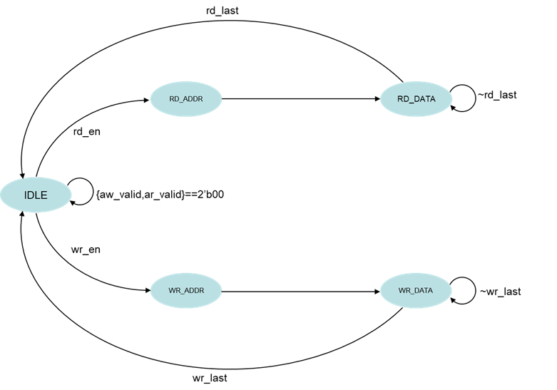

### Timing

写时序：

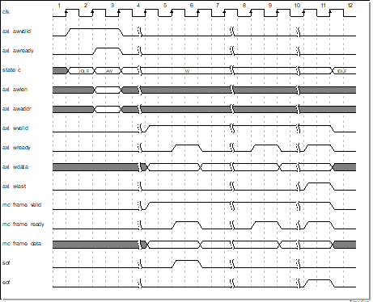

跨行写时序：

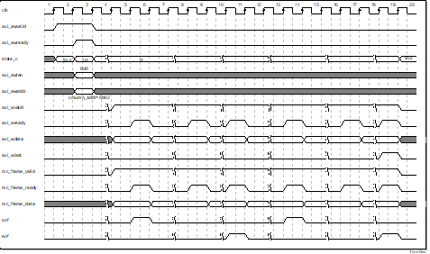

读时序：

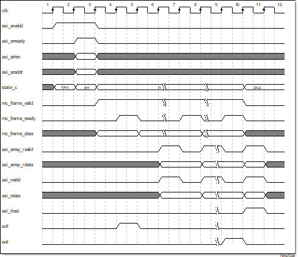

跨行读时序：

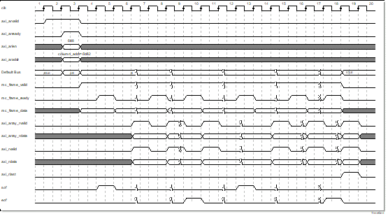

## Array Control

该模块实现了frame向array interface的转换，完成了对array的write、read、reflash的控制。

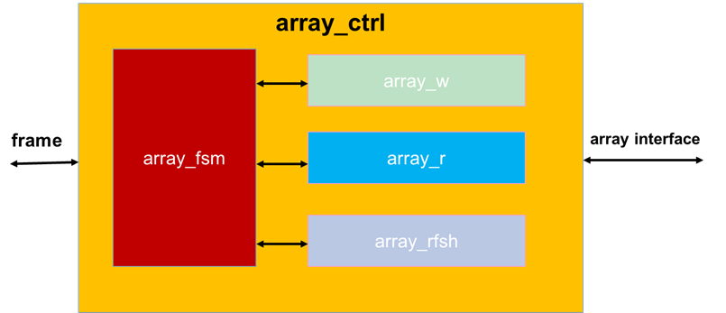

### Feature List

- 支持跨行操作
- 刷新周期小于64ms
- 最大支持一次操作64帧（write or read）
- 时序支持寄存器可配置

### FSM

Array FSM状态转移：

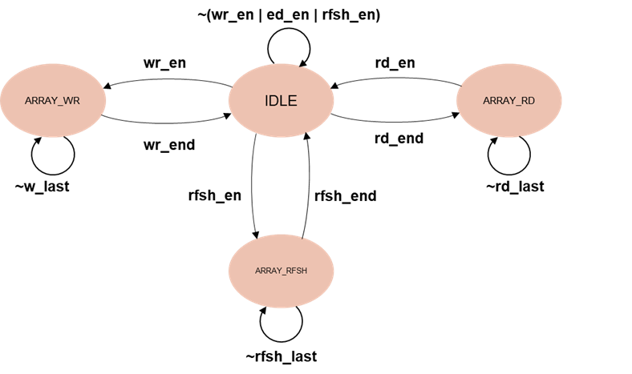

- `array_fsm`包含了`IDLE`，`ARRAY_WR`，`ARRAY_RD`，`ARRAY_RFSH`四个状态，其中：
- `wr_en`为跳转到写的条件`en_asyn2&&mc_frame_valid&&rw_flag&&sof`，其中`en_asyn2`为配置寄存器的`en`信号同步之后的结果 
- `rd_en`为跳转到读的条件`en_asyn2&&mc_frame_valid&&~rw_flag&&sof`
- `rfsh_en`的条件为`en_asyn2&&(rfsh_wait||rfsh_cnt==array_refresh_start-1'b1)`
- `wr_end`、`rd_end`、`rfsh_end`均来自于后面三个状态机的完成的最后一拍

Array write状态转移：

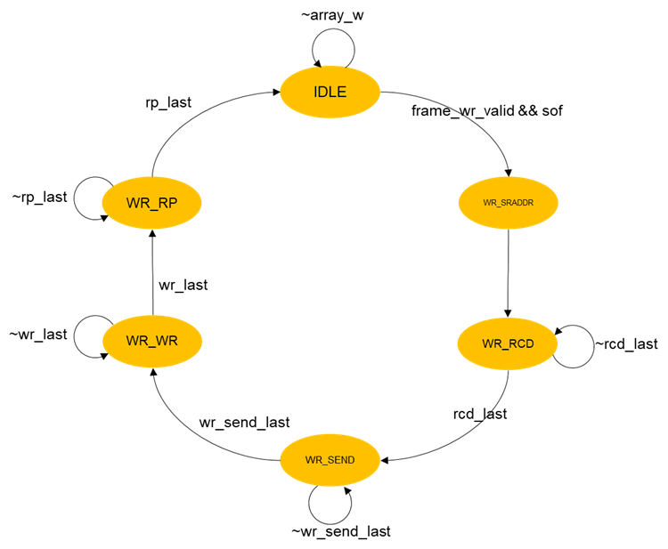

- 该状态机为为`array_w`状态机，`frame_wr_valid`为`array_fsm`的`frame_valid`的分配，其与上`sof`作为判断跳出`IDLE`状态
- 其中`rcd_last`、`wr_last`、`rp_last`均为对应状态最后一拍拉高，由对应计数器控制，`wr_last`需要同时满足`twr`和`tras`
- 而对于`wr_send_last`可以采用`eof`作为判断条件，`eof`为`fame`信号经过握手之后存到`frame_temp`寄存器之中在经过组合逻辑拆分
- `frame_wr_ready`应在`IDLE`状态为高
- `rp_end`输出作为`array_fsm`的`wr_end`信号

Array read状态转移：

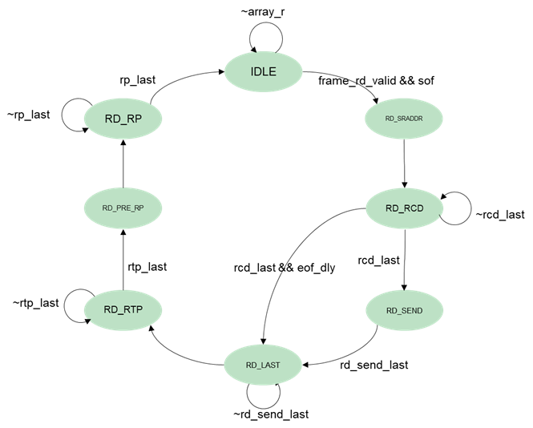

- 该状态机为为`array_r`状态机，`frame_rd_valid`为`array_fsm`的`frame_valid`的分配，其与`sof`作为判断跳出`IDLE`状态
- 其中`rcd_last`、`rtp_last`、`rp_last`均为对应状态最后一排拉高，由对应计数器控制，其中`rtp_last`为`tras`和`trtp`共同满足后的结果
- 而对于`rd_send_last`可以采用`eof`作为判断条件，`eof`为fame信号经过组合逻辑拆分
- `frame_rd_ready`应在`IDLE`状态为高
- `rp_last`输出作为`array_fsm`的`rd_end`信号
- 其中`RD_LAST`，`RD_PRE_RP`状态用于给计数器赋初值，采用减法计数的方式

Array refresh状态转移：

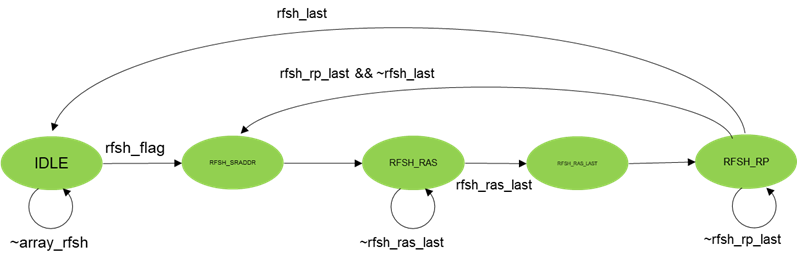

- 该状态机为为`array_rfsh`状态机，`rfsh_flag`为`array_fsm`的输出，作为判断跳出IDLE状态
- `rfsh_ras_last`在源代码中的条件为`fsm_cnt==8'd0`，即计数器清零
- `rfsh_last`的条件为`array_raddr==MAX_ROW_ADDR&&fsm_cnt==8'd0`，`MAX_ROW_ADDR`为最大的行地址
- `rfsh_end`输入作为`array_fsm`的`rfsh_end`信号，其逻辑为`state_c==RFSH_RP&&array_raddr==MAX_ROW_ADDR&&fsm_cnt==8'd0`

### Timing

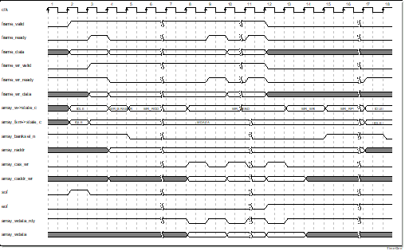

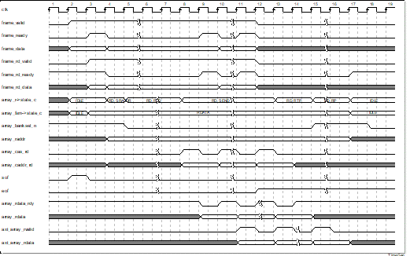

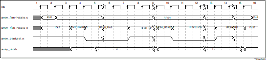