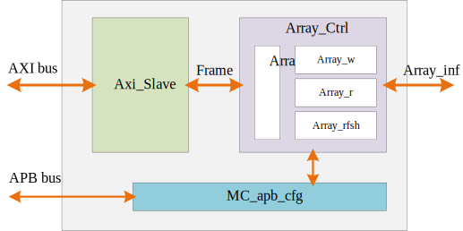

# Dram Controller

a Dram Controller

## Feature

This controller implements the read, write and refresh control of mem

- Array timing is configurable
- array refresh cycle is configurable
- Support AXI bus 2 Array bus
- Max 200Mhz

## Arch

- Axi_Slave: axi bus to frame
- Array_Ctrl: the read, write and refresh control of mem
- MC_apb_cfg: configure internal registers
